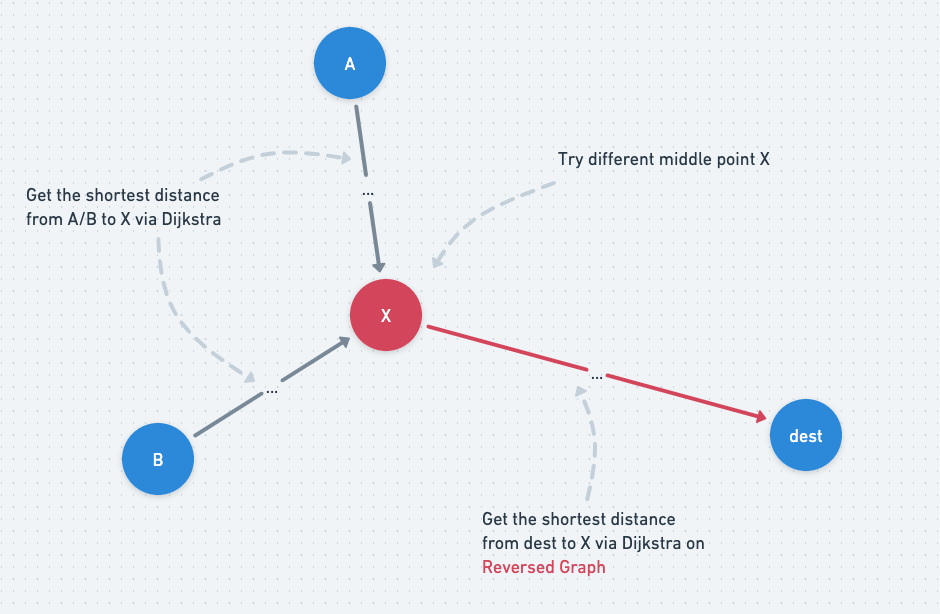

# [2203. Minimum Weighted Subgraph With the Required Paths (Hard)](https://leetcode.com/problems/minimum-weighted-subgraph-with-the-required-paths/)

<p>You are given an integer <code>n</code> denoting the number of nodes of a <strong>weighted directed</strong> graph. The nodes are numbered from <code>0</code> to <code>n - 1</code>.</p>

<p>You are also given a 2D integer array <code>edges</code> where <code>edges[i] = [from<sub>i</sub>, to<sub>i</sub>, weight<sub>i</sub>]</code> denotes that there exists a <strong>directed</strong> edge from <code>from<sub>i</sub></code> to <code>to<sub>i</sub></code> with weight <code>weight<sub>i</sub></code>.</p>

<p>Lastly, you are given three <strong>distinct</strong> integers <code>src1</code>, <code>src2</code>, and <code>dest</code> denoting three distinct nodes of the graph.</p>

<p>Return <em>the <strong>minimum weight</strong> of a subgraph of the graph such that it is <strong>possible</strong> to reach</em> <code>dest</code> <em>from both</em> <code>src1</code> <em>and</em> <code>src2</code> <em>via a set of edges of this subgraph</em>. In case such a subgraph does not exist, return <code>-1</code>.</p>

<p>A <strong>subgraph</strong> is a graph whose vertices and edges are subsets of the original graph. The <strong>weight</strong> of a subgraph is the sum of weights of its constituent edges.</p>

<p>&nbsp;</p>
<p><strong>Example 1:</strong></p>

<pre><strong>Input:</strong> n = 6, edges = [[0,2,2],[0,5,6],[1,0,3],[1,4,5],[2,1,1],[2,3,3],[2,3,4],[3,4,2],[4,5,1]], src1 = 0, src2 = 1, dest = 5
<strong>Output:</strong> 9
<strong>Explanation:</strong>
The above figure represents the input graph.
The blue edges represent one of the subgraphs that yield the optimal answer.
Note that the subgraph [[1,0,3],[0,5,6]] also yields the optimal answer. It is not possible to get a subgraph with less weight satisfying all the constraints.
</pre>

<p><strong>Example 2:</strong></p>

<pre><strong>Input:</strong> n = 3, edges = [[0,1,1],[2,1,1]], src1 = 0, src2 = 1, dest = 2
<strong>Output:</strong> -1
<strong>Explanation:</strong>
The above figure represents the input graph.
It can be seen that there does not exist any path from node 1 to node 2, hence there are no subgraphs satisfying all the constraints.
</pre>

<p>&nbsp;</p>
<p><strong>Constraints:</strong></p>

<ul>
	<li><code>3 &lt;= n &lt;= 10<sup>5</sup></code></li>
	<li><code>0 &lt;= edges.length &lt;= 10<sup>5</sup></code></li>
	<li><code>edges[i].length == 3</code></li>
	<li><code>0 &lt;= from<sub>i</sub>, to<sub>i</sub>, src1, src2, dest &lt;= n - 1</code></li>
	<li><code>from<sub>i</sub> != to<sub>i</sub></code></li>
	<li><code>src1</code>, <code>src2</code>, and <code>dest</code> are pairwise distinct.</li>
	<li><code>1 &lt;= weight[i] &lt;= 10<sup>5</sup></code></li>
</ul>


**Similar Questions**:
* [Minimum Cost to Make at Least One Valid Path in a Grid (Hard)](https://leetcode.com/problems/minimum-cost-to-make-at-least-one-valid-path-in-a-grid/)

## Solution 1. Dijkstra

Do Dijkstra 3 times.

First time: store the shortest distance from node `a` to all other nodes in array `da`.

Second time: store the shortest distance from node `b` to all other nodes in array `db`.

Third time: store the shortest distance from node `dest` to all other nodes **via Reversed Graph** in array `dd`.

The answer is the minimum `da[i] + db[i] + dd[i]` (`0 <= i < N`).



```cpp
// OJ: https://leetcode.com/problems/minimum-weighted-subgraph-with-the-required-paths/
// Author: github.com/lzl124631x
// Time: O(ElogE + N)
// Space: O(E)
class Solution {
    typedef pair<long, long> ipair;
public:
    long long minimumWeight(int n, vector<vector<int>>& E, int a, int b, int dest) {
        vector<vector<ipair>> G(n), R(n); // `G` is the original graph. `R` is the reversed graph
        for (auto &e : E) {
            long u = e[0], v = e[1], w = e[2];
            G[u].emplace_back(v, w);
            R[v].emplace_back(u, w);
        }
        vector<long> da(n, LONG_MAX), db(n, LONG_MAX), dd(n, LONG_MAX);
        auto solve = [&](vector<vector<ipair>> &G, int a, vector<long> &dist) {
            priority_queue<ipair, vector<ipair>, greater<ipair>> pq;
            dist[a] = 0;
            pq.emplace(0, a);
            while (pq.size()) {
                auto [cost, u] = pq.top();
                pq.pop();
                if (cost > dist[u]) continue;
                for (auto &[v, c] : G[u]) {
                    if (dist[v] > dist[u] + c) {
                        dist[v] = dist[u] + c;
                        pq.emplace(dist[v], v);
                    }
                }
            }
        };
        solve(G, a, da);
        solve(G, b, db);
        solve(R, dest, dd);
        long ans = LONG_MAX;
        for (int i = 0; i < n; ++i) {
            if (da[i] == LONG_MAX || db[i] == LONG_MAX || dd[i] == LONG_MAX) continue;
            ans = min(ans, da[i] + db[i] + dd[i]);
        }
        return ans == LONG_MAX ? -1 : ans;
    }
};
```

## Discuss

https://leetcode.com/problems/minimum-weighted-subgraph-with-the-required-paths/discuss/1844091/

Link to illustration: https://whimsical.com/2203-GLgvvsWiXznXswwd5YrmzM